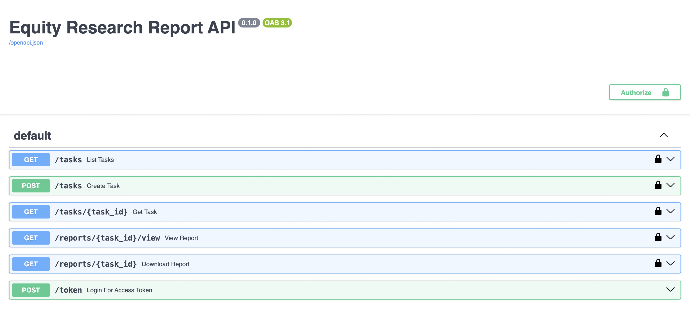

# Equity Research API

An API service for generating equity research reports using LLM technology. This is the technical assessment project from AIDF (Asian Institute of Digital Finance). 

## Features
- Generate comprehensive equity research reports for companies
- Convert reports to PDF format
- API authentication with api_key from users table integrated with JWT token. 
- Asynchronous task processing

## API Endpoints
| Method | Endpoint             | Description                                                    |
|--------|----------------------|----------------------------------------------------------------|
| POST   | `/tasks`             | Create a new task to generate a report.                        |
| GET    | `/tasks`             | Retrieve all report generation tasks list.                     |
| GET    | `/tasks/{task_id}`   | Get the status of a specific task.                             |
| GET    | `/reports/{task_id}/view` | View the generated report in HTML format.                      |
| GET    | `/reports/{task_id}` | Download the generated report from a certain task.             |
| POST   | `/token`             | Allows valid users to obtain a JWT token by providing username and password. |

## Tech Stack
- FastAPI for building the API
- Celery for asynchronous task processing
- Redis for task queue
- MySQL for storing task and report data
- Anthropic API for generating reports
## Environment Setup
1. You need to have a MySQL database installed on your local machine.
2. Run the following command to create a new conda environment and install the required packages
```zsh
conda create -n equity python=3.11 && conda activate equity && conda install fastapi uvicorn pymysql python-multipart celery redis-py toml anthropic markdown weasyprint python-jose  passlib yfinance pandas langchain langchain_anthropic
```
3. Run the following command to create users and tasks tables in your MySQL database and insert default user.
```python
python app/database.py
```
## Run
1. Go to the project root directory
```zsh
cd dir/where/your/equity-research-api
```
2. Start all the services in Mac (If you are using Windows, double click `start_services.bat`)
```bash
./start_services.sh
```
3. Next, you can call these api by using your custom api key defined in [config.toml](config/config_example.toml).  Through FastAPI [Interactive API docs](http://127.0.0.1:8000/docs#) provided by Swagger UI to test is highly recommended.

<p align="center">
  
</p>